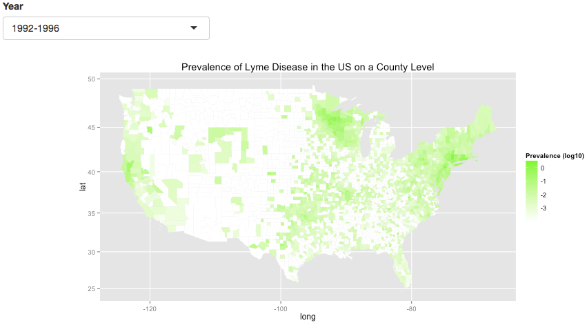
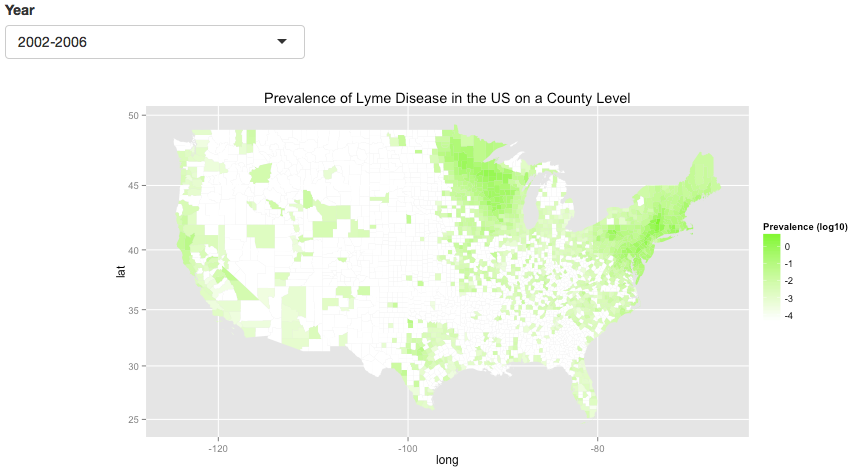
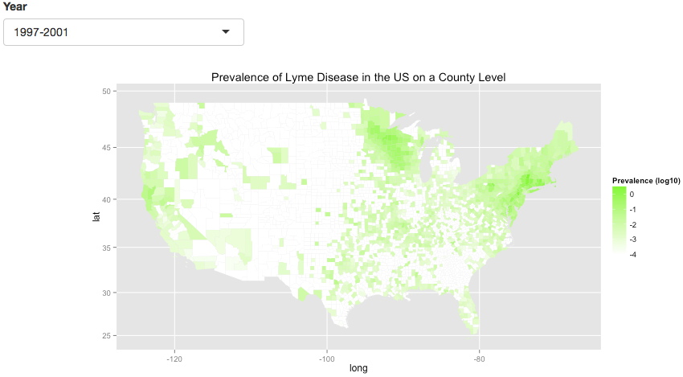

<style>

a {
    font-family: 'Helvetica Neue', Helvetica, sans-serif;
    font-weight: 200;
    font-size: 0.2in; 
    color: #006a00;
}

h2 { 
 color: #006a00; 
 font-family: 'Helvetica Neue', Helvetica, sans-serif;
  	font-weight: 100;
		font-size: 0.65in;  	

</style>

## What is Lyme Disease? {.smaller}
<div class="columns-2">
  - Infectious disease caused by the bacteria *Borrelia burgdorferi* 
    + gram-negative (inner and outer membrane)
    + spirochaete
    + outer surface proteins play large role in transmission
    
  - Ticks transmit bacteria by biting and feeding on humans 
  
 <br>
 *Ixodes scapularis* <br>
 [image](http://en.wikipedia.org/wiki/Lyme_disease) 
  
  
   [image](http://www.amazon.com/GIANTmicrobes-Disease-Borrelia-Burgdorferi-Microbe/dp/B000NO9HK2) <br>
   <br>
   [image](http://extralymey.com/en/lyme-disease/facts-of-lyme/) 
  
</div>

## Signs and Symptoms {.smaller}

<div class="columns-2">
  - Tell-tale sign is bulls-eye rash
  
  - **Early symptoms**
    + Fever
    + Severe fatigue
    + Chills
    + Joint and muscle aches
    + Swollen lymph nodes
    
  
  - **Late symptoms**
    + Facial palsy
    + Painful and swollen large joints
    + Shooting Pains
    + Heart palpitations
    + Arthritis
 
 
  <br>
   [image](http://www.wbur.org/npr/165115733/reinfection-with-lyme-disease-may-cause-chronic-symptoms) 
 
</div>


## Life Cycle of the Tick {.smaller}
<center>\center <br>
[image](http://www.nature.com/nrmicro/journal/v10/n2/pdf/nrmicro2714.pdf) 

- Risk of human infection highest in late spring and summer 

## Ticks {.smaller}

<div class="columns-2">

- Locate their hosts by percieving CO[2], body heat, odors, and vibrations
- Wait on the flora, ready to make contact with the host
- Only some species of *Ixodes* (genus of hard-bodied ticks) can transmit the bacteria 
- Discharge anesthetic saliva when biting
- Protein in saliva has shown to be immunosuppressive
- Must be attached for > 24 hours for risk of infection

  
  
  <br>
[image](http://knowbefore.weatherbug.com/2013/07/12/the-terror-behind-the-bite-lyme-disease/)
</div>

## Project Goals and Data Used {.smaller}

  - **Goals**
    + Interative map of Lyme disease occurrence in the US over time using the Shiny package
    + Map showing the relative population density as a measure of ruralness
    + Map showing relative percent of the population under 18 years old
    
    
    
  - **Data**
    + CDC file containing counts of confirmed Lyme disease cases [Link to Data](http://www.cdc.gov/lyme/resources/ldpublicuse.csv)
    + 2010 census data from [Social Explorer](http://www.socialexplorer.com/)
    + US county coordinates [Shapefiles](https://www.census.gov/geo/maps-data/data/cbf/cbf_counties.html)
    
    
# Results

## Data Tidying and Calculations

 - CDC Data was...
    + "tidyed" to ensure year range was a variable
    + altered so that FIPS codes matched census 
    + merged with census data 
    + merged with geocoordinate data
    
    
  - Prevalance was...
    + calculated as the number of confirmed cases in given time frame divided by the total state or county population
    + log10 transformed before plotting to better visualize relative differences


## US County Level Maps
  <br>
 

## US State Level Interactive Map
```{r, echo=FALSE, message=FALSE, warning=FALSE}
suppressPackageStartupMessages(library(ggplot2))
suppressPackageStartupMessages(library(dplyr))
suppressPackageStartupMessages(library(magrittr))
suppressPackageStartupMessages(library(knitr))
suppressPackageStartupMessages(library(tidyr))
suppressPackageStartupMessages(library(rgdal))
suppressPackageStartupMessages(library(rvest))
suppressPackageStartupMessages(library(maps))
suppressPackageStartupMessages(library(shiny))
suppressPackageStartupMessages(library(markdown))

# loading and tidying data 
lyme.disease.counts <- read.csv("lyme.disease.dataset.csv") %>%
  tbl_df %>%
  rename("1992-1996" = X1992.1996, "1997-2001" = X1997.2001, "2002-2006" = X2002.2006, "2007-2011" =  X2007.2011, CountyFIPS = CountyCode, StateFIPS = StateCode) %>%
  gather("year.range", "counts", 5:8) %>%
  filter(StateName != "Hawaii") %>%
  filter(StateName != "Alaska")

# adding zeros to CountyFIPS so that 3 digits in order to merge 
lyme.disease.counts$CountyFIPS <- sprintf("%03d", lyme.disease.counts$CountyFIPS)

# pasting StateFIPS and CountyFIPS to get full FIPS code 
lyme.disease.counts$FIPS <- paste(lyme.disease.counts$StateFIPS, lyme.disease.counts$CountyFIPS, sep = "")

# Census 2010 
census2010 <- read.csv("Census2010StateCounty.csv") %>%
  tbl_df %>%
  rename("FIPS" = Geo_FIPS, "pop.density" = SE_T002_002, "tot.pop" = SE_T001_001) %>%
  mutate(pop.under.eighteen = SE_T008_002 + SE_T008_003 + SE_T008_004 + SE_T008_005) %>%
  mutate(per.pop.under.eighteen = ((pop.under.eighteen/tot.pop) * 100)) %>%
  select(FIPS, pop.density, per.pop.under.eighteen, tot.pop)

# converting to character to match types for join
census2010$FIPS <- as.character(census2010$FIPS)

# lyme counts by county joined with census data by county
lyme.counts.census <- inner_join(lyme.disease.counts, census2010, by = "FIPS") %>%
  mutate(prevalence = (counts/tot.pop) *100) %>%
  select(-StateFIPS, -CountyFIPS)

## COUNTY LEVEL

# loading county level map of US

US.county <- readOGR(dsn=".", 
              layer="gz_2010_us_050_00_500k", 
              verbose=FALSE) 

US.county@data <- US.county@data %>% 
  mutate(county=paste(STATE,COUNTY,sep=""))

# Convert shapefile to ggplot'able object
US.county.map <- fortify(US.county, region="county") %>% 
  tbl_df()

# removes the leading zero in order to join id with FIPS
US.county.map$id <- as.integer(US.county.map$id)

# converting to integer to match types for join
lyme.counts.census$FIPS <- as.integer(lyme.counts.census$FIPS)

# joining county level lyme disease countys with US county geographical info and lightening the data set to run faster
lyme.counts.county.geo <- inner_join(lyme.counts.census, US.county.map, by = c("FIPS" = "id")) %>%
  select(-hole, -piece, -order, -counts, -tot.pop, -per.pop.under.eighteen, - pop.density, -StateName)

## STATE LEVEL

# totaling state counts and state population to calculate state prevalence 
lyme.state.prevalence <- group_by(lyme.counts.census, StateName, year.range) %>%
  summarise(tot.counts = sum(counts, na.rm = TRUE), tot.state.pop = sum(tot.pop, na.rm = TRUE))

# montana had zero cases from 1992-2006, replacing zeros with NAs (since log10 of 0 in INF) in the plot set NA values to result in white  
lyme.state.prevalence$tot.counts[lyme.state.prevalence$tot.counts == 0] <- NA

# calculating prevalence
lyme.state.prevalence <- mutate(lyme.state.prevalence, prevalence = (tot.counts/tot.state.pop)* 100)

# State map of US in 2010 
US.state <- map_data("state") %>% 
  tbl_df()

# clean text function
clean.text <- function(text){
  text <- gsub("[^[:alnum:]]", "", text)
  text <- gsub(" ", "", text)
  text <- tolower(text)
  return(text)
}

# cleaning up state names
lyme.state.prevalence$StateName <- clean.text(lyme.state.prevalence$StateName)
US.state$region <- clean.text(US.state$region)


# inner join with state geographic data
lyme.counts.states.geo <- inner_join(lyme.state.prevalence, US.state, by = c("StateName" = "region")) %>%
  select(-order, -subregion) 

# Creating POP DENSITY MAP and PERCENT POP UNDER 18 MAP

# converting for join with county level geography
census2010$FIPS <- as.numeric(census2010$FIPS)

# join of census data with county level geography
census.geo <- inner_join(census2010, US.county.map, by = c("FIPS" = "id")) %>%
  select(-hole, -piece, -order)
```

```{r, echo = FALSE}
# shiny select box 
library(shiny)

shinyApp(
  
  ui = fluidPage(
    selectInput("years", label = "Year",
              choices = c("1992-1996", "1997-2001", "2002-2006", "2007-2011")),
    plotOutput("county")
    ),
  server = function(input, output) {
    output$county <- renderPlot({
  year.choices <- input$years 
  lyme.counts.states.geo <- filter(lyme.counts.states.geo, year.range==year.choices)
  
 ggplot(lyme.counts.states.geo, aes(x=long, y=lat, group=group, fill = log10(prevalence))) +
  geom_polygon() +
  geom_path(col="black", size=0.05) +
  coord_map() +
  scale_fill_continuous(low="white", high="lawngreen", name="Prevalence (log10)", na.value = "white") +
  ggtitle("Prevalence of Lyme Disease in the US on a State Level")
})
},
  
  options = list(height = 500)
)


```

## Map of Population Density

```{r, echo=FALSE, message=FALSE, warning=FALSE}
# POP DENSITY MAP (lots of observations so it runs pretty slowly)
ggplot(census.geo, aes(x=long, y=lat, group=group, fill = log10(pop.density))) +
  geom_polygon() +
  geom_path(col="black", size=0) +
  coord_map() +
  scale_fill_continuous(low="white", high="black", name="Population Density", na.value = "white") +
  ggtitle("US Population Density Based on the 2010 Census")
```

## Map of Percent of Population Under 18 


```{r, echo=FALSE, message=FALSE, warning=FALSE}
# PERCENT POP UNDER 18 MAP (lots of observations so it runs pretty slowly)
ggplot(census.geo, aes(x=long, y=lat, group=group, fill = per.pop.under.eighteen)) +
  geom_polygon() +
  geom_path(col="black", size=0) +
  coord_map() +
  scale_fill_continuous(low="white", high="orange", name="Percent of Population \n under 18 Years Old", na.value = "white") +
  ggtitle("Percent of US Population under \n 18 Years Old Based on the 2010 Census")
```

## Counties with Highest Lyme Disease Prevalence

```{r, echo=FALSE, message=FALSE, warning=FALSE}
table <- arrange(lyme.counts.census, desc(prevalence)) %>%
  select(StateName, CountyName, prevalence, year.range) %>%
  mutate(LogPrevalence = log10(prevalence)) %>%
  rename(State = StateName, County = CountyName, Prevalence = prevalence) %>%
  slice(1:6)
  
kable(table, caption = "Top Counties with Highest Prevalence of Lyme Disease", col.names = colnames(table))
```

## Importance

- Range of Lyme disease increasing due in part to reforested lands


- Important to know how Lyme disease is changing geographically


- Awareness and prevention efforts should be focused in areas that are experiencing increases in cases or lack knowlege of the disease 


## References

http://www.cdc.gov/ticks/life_cycle_and_hosts.html
http://www.cdc.gov/lyme/transmission/index.html
http://www.cdc.gov/lyme/signs_symptoms/index.html
https://microbewiki.kenyon.edu/index.php/Borrelia_burgdorferi
http://www.nature.com/nrmicro/journal/v10/n2/pdf/nrmicro2714.pdf
http://www.ncbi.nlm.nih.gov/pmc/articles/PMC2238774/

## Questions


