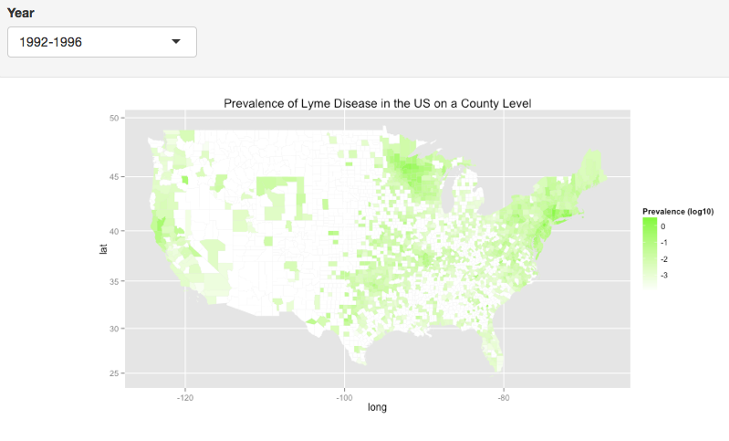

Lyme disease is the most-common vector-borne infectious disease in the US. 
This project aimed to create an interactive map of the prevalence of Lyme disease in the US from 1992-2011. Maps at the state and county level show how the spread of the disease has changed. A drop-down menu allows the viewer to select which year range for which they would like to view the map. 

Other census variables that may have some correlation to Lyme disease prevalence were mapped as well. 

