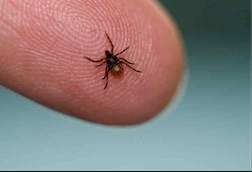

                                                           

Lyme disease is the most prevalent vector-borne illness in the US and case numbers have been rising steadily since 1995^1^. Infected ticks bite their host and transmit bacteria called Borrelia burgdorferi that cause infection. In the US, Lyme disease was first acknowledged in 1975 in Lyme, Connecticut when many children were diagnosed with juvenile rheumatoid arthritis, an uncommon disease^2^.  Lyme disease is often characterized by a large bulls eye rash. 

 

Common symptoms of the disease include: fever, severe fatigue, chills, muscle and joint aches, headache, and swollen lymph nodes^3^. The highest time for infection is during the spring and summer when ticks are alive and in abundance. Part of understanding this disease and spreading awareness is visualizing where cases are clustered and how that changes over time. Cases are increasing and it is important to know if that increase is in the same areas or new areas. This project has interactive maps of the prevalence of Lyme disease in the US from 1992-2011 on state and county levels. Data was downloaded from the CDC and contained counts of Lyme disease for each county in the US. The maps show relative high prevalence of Lyme disease in the northeast and north midwest. Maps of population density and percent of population under 18 were created. Since ticks are more common in wooded areas, I would have expected ruralness (as estimated by population density) to somewhat match the map of Lyme disease prevalence. However, it seemed that areas of greater population density actually mapped better. Since children most likely play outside more frequently than adults, I wanted to determine if Lyme disease was more prevalent in areas with a higher percent of children. This does not seem to be the case based on the maps except in the lower southwest. Limitations of this work include underreporting of cases, collecting of surveillance data based on county of residence, but not necessarily exposure, and changes in reported cases from year to year cannot be extrapolated to correspond directly to changes in incidence due to factors influencing a states' reporting^4^. 


^1^ http://www.idsociety.org/Lyme_Facts/ 

^2^ http://www.webmd.com/rheumatoid-arthritis/arthritis-lyme-disease

^3^ http://www.cdc.gov/lyme/signs_symptoms/index.html

^4^ http://www.cdc.gov/lyme/stats/survfaq.html


 


```{r, echo=FALSE, message=FALSE, warning=FALSE}
suppressPackageStartupMessages(library(ggplot2))
suppressPackageStartupMessages(library(dplyr))
suppressPackageStartupMessages(library(magrittr))
suppressPackageStartupMessages(library(knitr))
suppressPackageStartupMessages(library(tidyr))
suppressPackageStartupMessages(library(rgdal))
suppressPackageStartupMessages(library(rvest))
suppressPackageStartupMessages(library(maps))
suppressPackageStartupMessages(library(ggmap))
suppressPackageStartupMessages(library(shiny))

# loading and tidying data 
lyme.disease.counts <- read.csv("lyme.disease.dataset.csv") %>%
  tbl_df %>%
  rename("1992-1996" = X1992.1996, "1997-2001" = X1997.2001, "2002-2006" = X2002.2006, "2007-2011" =  X2007.2011, CountyFIPS = CountyCode, StateFIPS = StateCode) %>%
  gather("year.range", "counts", 5:8) %>%
  filter(StateName != "Hawaii") %>%
  filter(StateName != "Alaska")

# adding zeros to CountyFIPS so that 3 digits in order to merge 
lyme.disease.counts$CountyFIPS <- sprintf("%03d", lyme.disease.counts$CountyFIPS)

# pasting StateFIPS and CountyFIPS to get full FIPS code 
lyme.disease.counts$FIPS <- paste(lyme.disease.counts$StateFIPS, lyme.disease.counts$CountyFIPS, sep = "")

# Census 2010 
census2010 <- read.csv("Census2010StateCounty.csv") %>%
  tbl_df %>%
  rename("FIPS" = Geo_FIPS, "pop.density" = SE_T002_002, "tot.pop" = SE_T001_001) %>%
  mutate(pop.under.eighteen = SE_T008_002 + SE_T008_003 + SE_T008_004 + SE_T008_005) %>%
  mutate(per.pop.under.eighteen = ((pop.under.eighteen/tot.pop) * 100)) %>%
  select(FIPS, pop.density, per.pop.under.eighteen, tot.pop)

# converting to character to match types for join
census2010$FIPS <- as.character(census2010$FIPS)

# lyme counts by county joined with census data by county
lyme.counts.census <- inner_join(lyme.disease.counts, census2010, by = "FIPS") %>%
  mutate(prevalence = (counts/tot.pop) *100) %>%
  select(-StateFIPS, -CountyFIPS)
```

```{r, echo=FALSE, message=FALSE, warning=FALSE}
## COUNTY LEVEL

# loading county level map of US

US.county <- readOGR(dsn=".", 
              layer="gz_2010_us_050_00_500k", 
              verbose=FALSE) 

US.county@data <- US.county@data %>% 
  mutate(county=paste(STATE,COUNTY,sep=""))

# Convert shapefile to ggplot'able object
US.county.map <- fortify(US.county, region="county") %>% 
  tbl_df()

# removes the leading zero in order to join id with FIPS
US.county.map$id <- as.integer(US.county.map$id)

# converting to integer to match types for join
lyme.counts.census$FIPS <- as.integer(lyme.counts.census$FIPS)

# joining county level lyme disease countys with US county geographical info and lightening the data set to run faster
lyme.counts.county.geo <- inner_join(lyme.counts.census, US.county.map, by = c("FIPS" = "id")) %>%
  select(-hole, -piece, -order, -counts, -tot.pop, -per.pop.under.eighteen, - pop.density, -StateName)

# shiny select box 
inputPanel(
    selectInput("years", label = "Year",
              choices = c("1992-1996", "1997-2001", "2002-2006", "2007-2011"))
    )

# shiny map with select box for different year ranges
renderPlot({
  year.choices <- input$years 
  lyme.counts.county.geo <- filter(lyme.counts.county.geo, year.range==year.choices)
  
 ggplot(lyme.counts.county.geo, aes(x=long, y=lat, group=group, fill = log10(prevalence))) +
  geom_polygon() +
  geom_path(col="black", size=0) +
  coord_map() +
  scale_fill_continuous(low="white", high="lawngreen", name="Prevalence (log10)", na.value = "white") +
  ggtitle("Prevalence of Lyme Disease in the US on a County Level")
})

```


```{r, echo=FALSE, message=FALSE, warning=FALSE}
# Creating POP DENSITY MAP and PERCENT POP UNDER 18 MAP

# converting for join with county level geography
census2010$FIPS <- as.numeric(census2010$FIPS)

# join of census data with county level geography
census.geo <- inner_join(census2010, US.county.map, by = c("FIPS" = "id")) %>%
  select(-hole, -piece, -order)

# POP DENSITY MAP (lots of observations so it runs pretty slowly)
ggplot(census.geo, aes(x=long, y=lat, group=group, fill = log10(pop.density))) +
  geom_polygon() +
  geom_path(col="black", size=0) +
  coord_map() +
  scale_fill_continuous(low="white", high="black", name="Population Density", na.value = "white") +
  ggtitle("US Population Density Based on the 2010 Census")

# PERCENT POP UNDER 18 MAP (lots of observations so it runs pretty slowly)
ggplot(census.geo, aes(x=long, y=lat, group=group, fill = per.pop.under.eighteen)) +
  geom_polygon() +
  geom_path(col="black", size=0) +
  coord_map() +
  scale_fill_continuous(low="white", high="orange", name="Percent of Population \n under 18 Years Old", na.value = "white") +
  ggtitle("Percent of US Population under \n 18 Years Old Based on the 2010 Census")
```


```{r, echo=FALSE, message=FALSE, warning=FALSE}
# TABLES of TOP 20 counties with the most prevalence of Lyme Disease

# filtering data from 1992-1996
first.year <- filter(lyme.counts.census, year.range == "1992-1996") %>%
  arrange(desc(prevalence)) %>%
  select(StateName, CountyName, prevalence) %>%
  rename(State = StateName, County = CountyName, Prevalence = prevalence) %>%
  slice(1:20)

# TABLE of Prevalence 1997-1996
kable(first.year, caption = "Top 20 Counties with Highest Prevalence of Lyme Disease from 1992-1996", col.names = colnames(first.year))

# filtering data from 1997-2001
second.year <- filter(lyme.counts.census, year.range == "1997-2001") %>%
  arrange(desc(prevalence)) %>%
  select(StateName, CountyName, prevalence) %>%
  rename(State = StateName, County = CountyName, Prevalence = prevalence) %>%
  slice(1:20)

# TABLE of Prevalence 1997-2001
kable(second.year, caption = "Top 20 Counties with Highest Prevalence of Lyme Disease from 1997-2001", col.names = colnames(second.year))


# filtering data from 2002-2006
third.year <- filter(lyme.counts.census, year.range == "2002-2006") %>%
  arrange(desc(prevalence)) %>%
  select(StateName, CountyName, prevalence) %>%
  rename(State = StateName, County = CountyName, Prevalence = prevalence) %>%
  slice(1:20)

# TABLE of Prevalence 2002-2006
kable(third.year, caption = "Top 20 Counties with Highest Prevalence of Lyme Disease from 2002-2006", col.names = colnames(third.year))

# filtering data from 2007-2011
fourth.year <- filter(lyme.counts.census, year.range == "2007-2011") %>%
  arrange(desc(prevalence)) %>%
  select(StateName, CountyName, prevalence) %>%
  rename(State = StateName, County = CountyName, Prevalence = prevalence) %>%
  slice(1:20)

# TABLE of Prevalence 2007-2011
kable(fourth.year, caption = "Top 20 Counties with Highest Prevalence of Lyme Disease from 2007-2011", col.names = colnames(fourth.year))

```


```{r, echo=FALSE, message=FALSE, warning=FALSE}
## STATE LEVEL

# totaling state counts and state population to calculate state prevalence 
lyme.state.prevalence <- group_by(lyme.counts.census, StateName, year.range) %>%
  summarise(tot.counts = sum(counts, na.rm = TRUE), tot.state.pop = sum(tot.pop, na.rm = TRUE))

# montana had zero cases from 1992-2006, replacing zeros with NAs (since log10 of 0 in INF) in the plot set NA values to result in white  
lyme.state.prevalence$tot.counts[lyme.state.prevalence$tot.counts == 0] <- NA

# calculating prevalence
lyme.state.prevalence <- mutate(lyme.state.prevalence, prevalence = (tot.counts/tot.state.pop)* 100)

# State map of US in 2010 
US.state <- map_data("state") %>% 
  tbl_df()

# clean text function
clean.text <- function(text){
  text <- gsub("[^[:alnum:]]", "", text)
  text <- gsub(" ", "", text)
  text <- tolower(text)
  return(text)
}

# cleaning up state names
lyme.state.prevalence$StateName <- clean.text(lyme.state.prevalence$StateName)
US.state$region <- clean.text(US.state$region)


# inner join with state geographic data
lyme.counts.states.geo <- inner_join(lyme.state.prevalence, US.state, by = c("StateName" = "region")) %>%
  select(-order, -subregion) 

# shiny select box 
inputPanel(
    selectInput("years", label = "Year",
              choices = c("1992-1996", "1997-2001", "2002-2006", "2007-2011"))
    )

# shiny map with select box for different year ranges (lots of observations so it runs pretty slowly)
renderPlot({
  year.choices <- input$years 
  lyme.counts.states.geo <- filter(lyme.counts.states.geo, year.range==year.choices)
  
 ggplot(lyme.counts.states.geo, aes(x=long, y=lat, group=group, fill = log10(prevalence))) +
  geom_polygon() +
  geom_path(col="black", size=0.05) +
  coord_map() +
  scale_fill_continuous(low="white", high="lawngreen", name="Prevalence (log10)", na.value = "white") +
  ggtitle("Prevalence of Lyme Disease in the US on a State Level")
})

```

